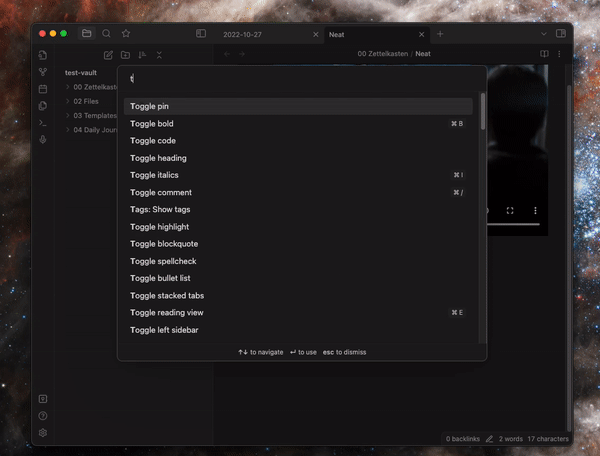

# Obsidian Transcription

A plugin to generate super-fast high-quality transcriptions of any audio and video file via [OpenAI Whisper](https://openai.com/blog/whisper/) and [Scribe by GambitEngine](https://scribe.gambitengine.com).

## Features

- Wide range of audio and video file formats supported via [ffmpeg](https://ffmpeg.org/) and [Scribe](https://scribe.gambitengine.com)
- Flexible transcription engines - cloud or local
  - [Scribe by GambitEngine](https://scribe.gambitengine.com)
  - [Whisper ASR](https://github.com/ahmetoner/whisper-asr-webservice)
- Customizable output format
- Start and end timestamps for each line of the transcription

## How to use

1. Install the plugin
2. Set up [Whisper ASR](https://github.com/ahmetoner/whisper-asr-webservice) or [GambitEngine Scribe](https://scribe.gambitengine.com/)
3. If not hosting locally, configure the URL of the transcription engine in the settings

## Credits

- [Whisper ASR](https://github.com/ahmetoner/whisper-asr-webservice) by Ahmed, for the easy-to-use Whisper webservice backend
